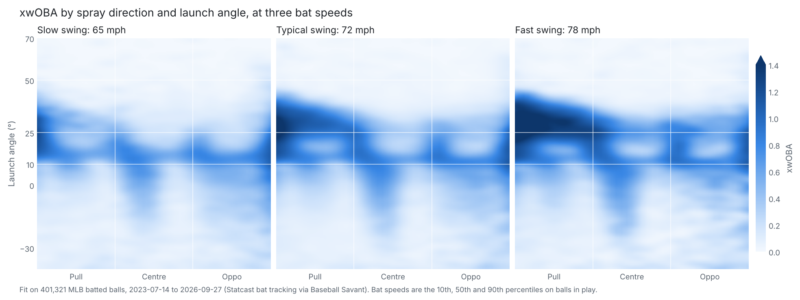

# 3D xwOBA

Expected wOBA of a batted ball from three inputs and nothing else: **spray direction, launch
angle and bat speed**. It answers *what is a ball hit in this direction, at this angle, off a
swing this fast worth on average?* There is no exit velocity in it, so it credits a hitter for
how fast they swing and where they hit the ball, but not for how squarely they hit it — that
part, with the luck, is what is left over in wOBA − xwOBA.



## The model

**Inputs.**

| input | units | convention |
|---|---|---|
| `spray` | degrees | the Batted Ball Charts page's: 0 at the pull-side foul line, 45 dead centre, 90 at the opposite line, for either hand. A ball caught in foul territory falls outside 0–90. From Savant's hit coordinates with the scraper's home plate (`statfast._spray_angle` + 45). |
| `launch_angle` | degrees | Statcast's. |
| `bat_speed` | mph | Statcast bat tracking: the speed of the sweet spot at contact. |

**Output.** The probability of each of the five wOBA values a ball in play can have — an out
(sac flies included), a single (Savant gives an error and a fielder's choice the batter reaches
on the same 0.90), a double, a triple, a home run — and xwOBA, their weighted sum with Savant's
weights, which are the same every season:

    xwOBA = 0.90 p(1B) + 1.25 p(2B) + 1.60 p(3B) + 2.00 p(HR)

**How it is fit.** Every node of a fine grid (1° of spray × 1° of launch angle × 1 mph of bat
speed) gets the outcome mix of the batted balls around it, weighted by a Gaussian kernel 3°
wide in spray, 1.5° in launch angle and 6 mph in bat speed, with three refinements on a plain
kernel average:

- **A plane, not an average.** Each node fits a kernel-weighted plane through the outcomes and
  reads it at the node (a local-linear fit). Around an 80 mph swing there are far more 75 mph
  swings than 85 mph ones, so a plain average drags the fastest swings' home-run rate toward
  the slower ones'; on simulated data with a known answer the plane halved that bias, and out
  of fold on real data it beat the plain average at each width tried.
- **A second pass.** Any kernel flattens what is sharp: the line-drive peak at 12–13° of launch
  angle (actual wOBA .80), the dip just above it where liners carry to the outfielders (.63–.65
  at 17–20°), the edges of the home-run band. Squared error barely notices, since one ball's
  outcome is mostly noise, but a hitter's xwOBA averages hundreds of balls and keeps the bias.
  So the residuals of the first pass are smoothed the same way and added back (Tukey's
  "twicing"), each probability kept to at least half its first-pass value so no outcome is
  ever ruled out.
- **Shrinkage where balls are scarce.** Each node is pulled toward the same neighbourhood seen
  through a kernel twice as wide, by 25 balls' worth, and that toward the league's mix, so a
  70° pop up off a 45 mph swing leans on its neighbours rather than a handful of balls.

The sums the fits need at every node are Gaussian blurs (and derivatives of them) of a
histogram of the balls, so the whole 2-million-node grid fits in seconds. The parameters were
chosen by five-fold cross-validation over games on 2023–2025, on squared error, log loss and
calibration together: squared error alone would take a 2° launch-angle kernel and leave the
5° launch-angle bands around the line-drive peak up to 0.016 off. The saved grid keeps every
whole degree of launch angle (the input is recorded in whole degrees, and a 2° step would read
every odd degree off a line between its neighbours, 0.014 off at worst), every 2° of spray and
every 3 mph of bat speed, where the kernels are wide enough to read between nodes; a ball is
read off it by trilinear interpolation, with inputs beyond the grid clamped to its edge.

**Data.** Every regular-season ball in play with bat tracking from Baseball Savant's Statcast
search (bat tracking starts on 14 July 2023), less bunts, sac bunts and catcher's interference,
and the ~4% of swings with no bat speed. The completed-games Parquet the rest of the site uses
comes from the Stats API, which carries no bat tracking, so this is the one tool that reads
Savant's search directly.

## Using it

```python
import json, sys

sys.path.insert(0, "tools/xwoba")
from model import Grid

grid = Grid.from_json(json.load(open("tools/xwoba/model.json")))
grid.xwoba([15, 45], [28, -5], [78, 70])  # spray, launch angle, bat speed -> xwOBA per ball
grid.predict([15, 45], [28, -5], [78, 70])  # the five outcome probabilities per ball
```

`model.json` is plain JSON for reading anywhere: `axes` gives each input's `lo`, `hi`, `step`
and `n`; `probs` holds the four hit classes as integers in units of 1/`scale`, row-major over
`inputs` (spray, then launch angle, then bat speed fastest), and the out probability is
whatever is left. Clamp an input to its axis, find its fractional node index, and interpolate
between the eight surrounding nodes.

## How well it does

Fit on 2023–2025 and scored on all 118,189 balls in play from 2026, which the fit never saw
(the full report, with calibration tables, is [evaluation.md](evaluation.md)):

| model | RMSE | R² | log loss |
|---|--:|--:|--:|
| League average | 0.5724 | 0.000 | 0.939 |
| Launch angle alone | 0.5111 | 0.203 | 0.718 |
| Launch angle + bat speed | 0.5006 | 0.235 | 0.700 |
| Spray + launch angle | 0.4701 | 0.326 | 0.623 |
| **3D model** | **0.4610** | **0.351** | **0.608** |
| Gradient boosting on the same three inputs | 0.4612 | 0.351 | 0.607 |
| Savant's xwOBA (exit velocity + launch angle) | 0.4287 | 0.439 | – |

- **Every input earns its place.** Spray direction is worth more than bat speed (it is where
  the fielders are), but bat speed still adds on top of the other two.
- **It matches gradient boosting** on the same inputs, and is smooth where boosting is a sum of
  steps. Out of fold on 2023–2025 its calibration error is 0.0066 (boosting 0.0045; about 0.004
  is sampling noise), against 0.0158 for one pass without twicing.
- **It trails Savant's xwOBA, as it should.** Exit velocity says how squarely the ball was
  hit; bat speed says only how hard the swing was.

**Hitters.** Per hitter-season (100+ batted balls), 3D xwOBA on contact is much steadier year
to year than wOBA on contact (r = 0.66 against 0.49; Savant's xwOBA 0.75), but it predicts the
next season's wOBA on contact no better than wOBA on contact itself does (0.49 against 0.49;
Savant's 0.60). What it measures is a hitter's swing speed and where they hit the ball, not
how often they square it up, and the second matters to next year's results too.

**Seasons differ.** Mean bat speed on balls in play rose from 71.2 mph in 2024 to 71.7 in 2026
with no more wOBA on contact to show for it (exit velocity at a given bat speed fell), so the
model fit on 2023–2025 reads 2026 0.012 high, as Savant's exit-velocity model reads it 0.011
low. Compare hitters within a season, or against the season's league-wide xwOBA, rather than
raw values across seasons.

**What it leaves out**, beyond exit velocity: the batter's sprint speed (Savant's xwOBA uses it
on topped and weakly hit balls), the park, the fielders' positioning, the weather. Spray is
measured from the pull line, so the two sides of a park are averaged and left- and
right-handed hitters share one surface. Bunts are left out, and a swing without bat tracking
has no xwOBA here.

## Files

| file | role |
|---|---|
| `savant.py` | pulls every regular-season ball in play from Savant a week at a time, caches each week under `cache/`, and turns them into the model's frame |
| `model.py` | the model: the grid, the local-linear smoother, prediction, and the JSON format |
| `build.py` | fits the model on every season with bat tracking and writes `model.json`; `--tune` cross-validates the parameters first |
| `evaluate.py` | holds out the latest season and writes `evaluation.md` |
| `plot.py` | draws `surface.png` from `model.json` |

## Rebuilding

From the repo root:

```bash
pip install -r tools/xwoba/requirements.txt
python tools/xwoba/build.py --cv     # pulls what isn't cached (~5 minutes cold), fits, writes model.json
python tools/xwoba/evaluate.py       # evaluation.md, testing on the current season
python tools/xwoba/plot.py           # surface.png
```

`build.py --tune` searches the parameters on squared error alone (about an hour); weigh what it
finds against log loss and calibration (`evaluate.py`) before moving `model.Params`' defaults. The first pull asks Savant for ~130 weeks of balls in play, three at
a time; after that only weeks newer than three days are fetched again. The code passes
`ruff check` and `ruff format` with the config in `ruff.toml`.
